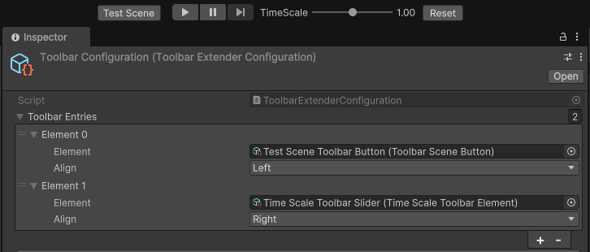
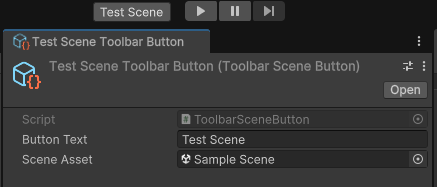

## Unity Toolbar Extender
A Unity package that allows you to extend the Unity Editor toolbar with custom buttons and controls using `Visual Elements`.


### Install via manifest
```json
"com.alexandros.unity-toolbar-extender": "https://github.com/alexisstrat/unity-toolbar-extender.git?path=/Packages/com.alexandros.unity-toolbar-extender"
```
### Usage:
1. Create a new Configuration via create -> Toolbar Extender/Configuration.
2. Create a scriptable object that inherits from `ToolbarElement.cs` and implement the `CreateElement` method.
3. Add the scriptable object to the `ToolbarElement` field in the configuration.

### Creating a button:
Inherit from `ToolbarButton` and implement the `OnClick` method.
```csharp
[CreateAssetMenu(menuName = "Toolbar Extender/Example Button")]
public class ExampleToolbarButton : ToolbarButton
{
    protected override void OnClick()
    {
        Debug.Log("Example Toolbar Button Clicked!");
    }
}
```

### Creating a slider:
Inherit from `ToolbarSlider` and implement the `OnValueChanged` method.
```csharp
[CreateAssetMenu (menuName = "Toolbar Extender/Example Slider")]
public class ExampleSlider : ToolbarSlider
{
    protected override void OnValueChanged(float newValue)
    {
        Debug.Log($"Slider value changed: {newValue}");
    }
}
```

### Ready-made controls:
- <b>Toolbar Extender/Scene Button</b>: Adds a button to the toolbar that opens a specified scene.



### Known Issues:
When moving UnityEditor to a different resolution monitor, the toolbar may disappear. Find your configuration scriptable
and click "Manual Refresh" or recompile.